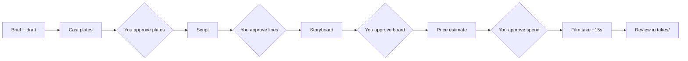

# Fictora episode production — partner guide

This guide is for **creators and producers** who use [fictora-content-creation](https://github.com/DreamFlux-Workspace/fictora-content-creation) with **Cursor** (or Claude Code) to make short vertical episodes on the hosted **Drama Generation API**. You do not need the private `fictora-drama` repo or any UI inside Fictora—your **desk folder** is where you review plates, boards, and takes.

---

## What you get

- A **series desk** on your Mac (default: `~/Downloads/documents/…`) with folders for each episode.
- An **AI agent** that calls the production API one step at a time and stops for your approval.
- **MiniMax H3** visual-first episode 1: cast portraits, script, storyboard, then a ~15s take with post-production (voice, mix, **burned-in captions** when post completes).

You **approve** faces, lines, and boards before money is spent on filming.

---

## What you need from DreamFlux / engineering

| Item | Notes |
| --- | --- |
| **GitHub access** | Clone `DreamFlux-Workspace/fictora-content-creation` |
| **API service token** | `FICTORA_DRAMA_GENERATION_SERVICE_TOKEN` — put in repo `.env` only |
| **Cursor** (recommended) | Open the cloned repo as the workspace |

**Never** paste the token into chat, Slack, or email. **Never** commit `.env`.

---

## One-time setup (about 10 minutes)

1. **Install [uv](https://docs.astral.sh/uv/)** (Python package runner).

2. **Clone and configure:**

   ```bash
   git clone https://github.com/DreamFlux-Workspace/fictora-content-creation.git
   cd fictora-content-creation
   cp .env.example .env
   ```

   Edit `.env` and set your service token. The base URL is already set for production.

3. **Install dependencies:**

   ```bash
   uv sync
   ```

4. **Open the folder in Cursor.** The agent should use the **episode-production** skill (included under `.cursor/skills/`).

---

## How production works (plain language)



1. **Brief** — You and the agent agree on premise, cast, set, and visual lock (one horror beat, one speaking line, etc.).
2. **Cast** — API draws character plates. You open `ep01/plates/` and say **yes** or what to fix.
3. **Script** — Lines are locked on the spine. You approve the wording (original + translation if needed).
4. **Board** — Storyboard mosaic lands in `ep01/boards/`. The agent reports **brightness**; dim boards may need `--accept-dim` if you still want to proceed.
5. **Estimate** — You see a dollar amount (often about **$1.20** for a single 15s take; exact number comes from the API or desk config fallback).
6. **Take** — After you say **yes to spend**, the agent enrols video. This step can run **20–30+ minutes** (long stretch at “50%” while post-production runs on the server).
7. **Delivery** — Finished file should appear under `ep01/takes/` with API snapshots in `ep01/api/`.

**Silence is not approval.** Each gate needs a fresh **yes** in that episode.

---

## Your desk folder

After the agent starts a series, you will see something like:

```
my-series-2026-09-22/
  production.json          ← phase (what step is next)
  production.config.json   ← clip length, captions, draft count (usually 4)
  ep01/
    brief.md
    plates/                ← approve faces here
    scripts/
    boards/                ← approve storyboard here
    takes/                 ← final (or in-progress) video
    api/                   ← JSON log of API calls (for debugging)
    run-notes.md           ← agent ledger
```

You review **images and video**, not JSON, unless something breaks.

---

## What to say to the agent

**Start a new series:**

> Start episode production for "\<Series Name\>". Band 15s, MiniMax H3, visual-first ep1. Premise: \<your prompt\>. Put the desk under `~/Downloads/documents/`.

**At each gate**, open the path the agent gives you, then:

- **Plates:** “plates ok” or describe what’s wrong with the face/outfit.
- **Script:** “script ok” or paste revised lines.
- **Board:** “board ok” or reject with a cause; if the agent says the board is dim and you accept it, say so explicitly.
- **Cost:** “yes” only when you accept the estimate shown in chat.

**After spend is confirmed**, let the agent run **one** video step and poll; do not rush a second enrol while the job is still running.

---

## Commands (optional — agent usually runs these)

| Action | Command |
| --- | --- |
| Start desk | `uv run fictora-produce start --series "…" --prompt "…" --band 15s` |
| Next API step | `uv run fictora-produce step --desk <path>` |
| Approve a gate | `uv run fictora-produce approve --desk <path> --gate plates\|script\|board` |
| Confirm spend + film | `uv run fictora-produce step --desk <path> --confirm-spend` |
| Where am I? | `uv run fictora-produce status --desk <path>` |

Full CLI details: [README](../README.md).

---

## Captions and sound

- The **video model** does not draw subtitles. **Captions are burned in during post-production** when `caption_style: house` is set (default).
- You only see them on the **finished deliverable**, not on raw previews mid-job.
- If a line is very short on screen, captions may appear only for a **few seconds**—scrub to the spoken beat.

---

## When something goes wrong

| Symptom | What it usually means | What to do |
| --- | --- | --- |
| CLI stops with “error reading body from connection” | Network/proxy blip while **polling** | Ask the agent to run `step` again on the **same desk**—the job often still runs on the server |
| Job stuck at **50%** for a long time | Post-production (ffmpeg, mix, captions) | Wait; trust API job status. Can take 20–30+ minutes |
| **503 restate_unavailable** | Orchestration briefly down | Retry `step` when engineering confirms prod is healthy |
| Wrong face after plates approved | Gate was skipped | Do not approve plates until you have opened the files |
| Video failed / stuck | Server or inspection error | Agent can `cancel-job` and retry with a fresh idempotency key (see skill reference) |

Deep troubleshooting: [content-ops/reference in the skill](../.cursor/skills/episode-production/reference.md) and [runbook](content-ops/runbook.md).

---

## What not to do

- Do **not** clone or ask for **fictora-drama** (prompts and compilers stay server-side).
- Do **not** approve plates, script, and board in one message without looking at the files.
- Do **not** share your **service token** or commit `.env`.
- Do **not** assume a “yes” from a previous episode carries over.

---

## Further reading (in the repo)

| Document | Audience |
| --- | --- |
| [README](../README.md) | Setup, commands, layout |
| [content-ops/README.md](content-ops/README.md) | Desk kit + agent rules |
| [content-ops/runbook.md](content-ops/runbook.md) | Full nine-stage production craft |
| [content-ops/api-map.md](content-ops/api-map.md) | Which API stages exist |
| [AGENTS.md](../AGENTS.md) | Rules for coding agents |

**Repository:** https://github.com/DreamFlux-Workspace/fictora-content-creation  

**OpenAPI (integrators):** https://fictora-drama-generation-prod-drama.up.railway.app/openapi.json  

---

## Support

For **API tokens**, **outages**, or **billing**, contact your DreamFlux / Fictora engineering contact.  

For **how to run a desk session**, share this guide and the repo link with your producer; use Cursor with the **episode-production** skill and keep the human gates above.
