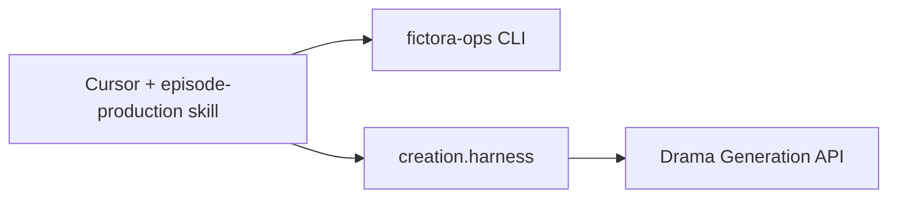

# Extending the creation layer

## Stack



## Add a workflow

1. **Desk state** — extend `creation.ops.state` / `floor.py` if you need new gate types.
2. **API steps** — add functions in `creation.harness.stages_gated` (or a new `stages_ep2.py`). Keep enrol and approve separate.
3. **Skill** — update `.cursor/skills/episode-production/SKILL.md` so agents know the order and stop points.

Do not add a dependency on `fictora-drama`. If the API lacks an endpoint, log a gap in your fork's docs and use a documented **deviation** — do not copy prompts from the service repo.

## Presets and lanes

List presets: `GET /v1/art-style-presets`. Pin `model_overrides.video` (e.g. `minimax-h3`) on draft and reuse bodies. Lane behavior is server-defined.

## Credentials

```python
from pathlib import Path
from creation.harness.credentials import load_drama_api_credentials

base, token = load_drama_api_credentials(Path(".").resolve())
```

Optional Railway CLI fallback exists in `credentials.py` for DreamFlux engineers only.
