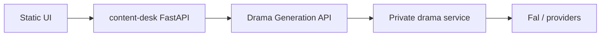

# Extending Content Creation

## Architecture

Your fork or PR touches **UI** and **BFF** only. The worker owns prompts, compilers, and media pipelines.

## Typical extensions

| Goal | Where to work |
| --- | --- |
| New gate or button | `static/app.js`, route in `content_desk/main.py` |
| Multi-episode desk | `content_desk/store.py`, `content_desk/flow.py` |
| Different default lane | `CreateDeskRequest.video_lane`, UI form |
| Webhook on completion | New BFF route; poll or subscribe via API if exposed |

## API flow (episode 1, visual-first)

1. `POST /v1/prompt-video-authoring-drafts` — plan job  
2. `POST /v1/spines/{id}/cast/enrol` → approve cast  
3. `POST /v1/spines/{id}/approve` — script gate  
4. `POST /v1/spines/{id}/boards/enrol` → `GET .../boards/exposure` → approve boards  
5. `POST /v1/spines/{id}/batches/estimate`  
6. `POST /v1/video-generations` → `GET .../delivery`

See [drama-api-v1.md](drama-api-v1.md) and live OpenAPI for field names.

## Local data

Desk JSON and debug artefacts: `CONTENT_DESK_DATA_DIR` (default `~/Downloads/content-desk-data`). Safe to delete between runs; no prompts are stored there beyond API JSON echoes.
